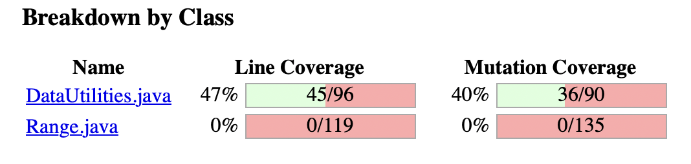
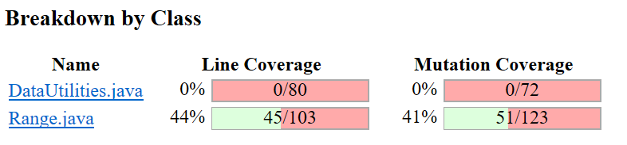
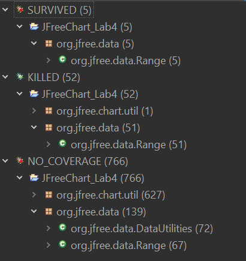

**SENG 637 - Dependability and Reliability of Software Systems**

**Lab. Report \#4 – Mutation Testing and Web app testing**

| Group: 22      |
|-----------------|
| Student 1 Jeremy Sugimoto                |   
| Student 2 Matt De Filippo             |   
| Student 3 Momin Muhammad               |   
| Student 4 Redge Santillan                |   
| Student 5 Shad Sajid               |  

# Table of Contents

1. [Introduction](#1-introduction)
2. [Analysis of 10 Mutants of the Range class](#2-analysis-of-10-mutants-of-the-range-class)
3. [Report all the statistics and the mutation score for each test class](#3-report-all-the-statistics-and-the-mutation-score-for-each-test-class)
4. [Analysis drawn on the effectiveness of each of the test classes](#4-analysis-drawn-on-the-effectiveness-of-each-of-the-test-classes)
5. [A discussion on the effect of equivalent mutants on mutation score accuracy](#5-a-discussion-on-the-effect-of-equivalent-mutants-on-mutation-score-accuracy)
6. [A discussion of what could have been done to improve the mutation score of the test suites](#6-a-discussion-of-what-could-have-been-done-to-improve-the-mutation-score-of-the-test-suites)
7. [Why do we need mutation testing? Advantages and disadvantages of mutation testing](#7-why-do-we-need-mutation-testing-advantages-and-disadvantages-of-mutation-testing)
8. [Explain your SELENIUM test case design process](#8-explain-your-selenium-test-case-design-process)
9. [Explain the use of assertions and checkpoints](#9-explain-the-use-of-assertions-and-checkpoints)
10. [How did you test each functionality with different test data](#10-how-did-you-test-each-functionaity-with-different-test-data)
11. [How the team work/effort was divided and managed](#11-how-the-team-workeffort-was-divided-and-managed)
12. [Difficulties encountered, challenges overcome, and lessons learned](#12-difficulties-encountered-challenges-overcome-and-lessons-learned)
13. [Comments/feedback on the assignment itself](#13-commentsfeedback-on-the-assignment-itself)

# 1 Introduction

In this assignment, we performed mutation testing (using PITest) on the DataUtilities and Range classes examined in previous labs. We examined ten (10) specific mutations generated by PITest. The overall mutation score was analyzed and improved by expanding the test suite. 

We also performed GUI testing using the Selenium web-interface testing tool; the system under test was the home depot website ([www.homedepot.com](https://www.homedepot.com/)). We developed ten (10) specific test cases, adding verification points as appropriate.

This document will outline the results of our mutation and GUI testing. Additionally, we will be discussing how we collaborated and divided the work amongst ourselves, and any challenges we encountered along the way.

# 2 Analysis of 10 Mutants of the Range class 

### Mutation #1 (on line #225, Mutation #6)

PITest applied the following mutation: 'Incremented (a++) double local variable number 2 --> SURVIVED' on the method 'combine(Range range 1, Range range 2)'. This was applied to code line 225 which is shown below:

```
return new Range(l, u);
```

This mutation uses the post-increment operator to add 1 to the lower bound variable, l. This has no effect because the increment occurs after the constructor Range(l, u) is called. The variable, l is local to the combine() method and is not used again. Therefore, the mutation survives but it does not signify any significant issue with the test code.

### Mutation #2 (on line #225, mutation #10)

PITest applied the following mutation: 'Incremented (++a) double local variable number 2 → KILLED' on the method 'combine(Range range 1, Range range 2)'. This was applied to code line 225 which is shown below:

```
return new Range(l, u);
```

This mutation uses the pre-increment operator to add 1 to the lower bound variable, l. This effectively raises the lower bound that is input into the Range(l, u) constructor. Therefore, this mutation results in incorrect output and must be caught by the test cases. This mutation is killed because there are several test cases which correctly check that the output range of the combine method matches the expected output (such as testCombineEqualRanges(), testCombineUBToMax(), etc.).

### Mutation #3 (on line #430, mutation #1)

PITest applied the following mutation: `negated conditional → KILLED` on the `equals(Object obj)` method. This was applied to the following line in the code:

```
if (!(this.lower == range.lower)) 
```

This mutation inverts the logical condition of the expression and changes the expression to “not equal (!=).” This would therefore evaluate whether this.lower is not equal to range.lower. By negating the conditional, this mutation could potentially cause an error if the original conditional statement was important for the correctness of the code. The negated conditional could lead to unintended behaviors. The mutation is killed, indicating that the test suite is robust enough to successfully identify changes caused by the mutation.

### Mutation #4 (on line #434, mutation #1)

PITest applied the following mutation: `replaced boolean return with true for org/jfree/data/Range::equals → KILLED` on the `equals(Object obj)` method. This was applied to the return statement in the following code block:

```
if (!(this.upper == range.upper)) { 
return false;
}
```

This mutation changes the return from “false” to "true." This effectively contradicts the original logic of the “if” statement and causes the method to erroneously claim that all ‘Range’ objects are equal. By replacing the return with "true,"  the code no longer considers the upper bound of the “Range” object and instead claims that all instances are equal, regardless of the actual upper bound value. The mutation is killed, however, indicating that the set of test cases, specifically the `testEqualsSameUpperBoundDifferentInstance` and `testEqualsDifferentUpperBoundSameInstance` test cases correctly identified the changes.

### Mutation #5 (on Line #144, Mutation #9)
PITest applied the following mutation: 'Removed conditional - replaced comparison check with false → KILLED' in the method 'contains(value)'. This was applied to line 144, as shown below:

```
return (value >= this.lower && value <= this.upper);
```

This mutation replaces the condition '(value >= this.lower && value <= this.upper)' with false, ensuring the method always returns false. This mutation is considered "killed" because there are multiple test cases that verify the method's output is true in scenarios where it should be true (e.g., testNOMForContains(), testBUBForContains(), etc.).

### Mutation #6 (on Line #144, Mutation #16)
PITest applied the following mutation: 'Negated double field lower → KILLED' in the method 'contains(value)'. This was applied to line 144, as shown below:

```
return (value >= this.lower && value <= this.upper);
```

This mutation negates this.lower (-this.lower), rendering it "killed" due to the presence of multiple test cases that validate the method's accuracy at and around its lower boundary (e.g., testBLBForContains(), testLBForContains(), etc.).

### Mutation #7 (on Line #157, Mutation #1)
PITest applied the following mutation: 'changed conditional boundary → SURVIVED' in the method 'intersects(double b0, double b1)'. This was applied to line 157, as shown below:

```
if (b0 <= this.lower) {
```

This mutation replaces the condition '(b0 <= this.lower)' with '(b0 < this.lower)'. This mutation is considered "survived" because there were multiple test cases that did not have a ‘b0’ value equal to ‘lower’ thus the condition would react the same way even with the mutation.

### Mutation #8 (on Line #105, Mutation #1)
PITest applied the following mutation: 'replaced double return with 0.0d for org/jfree/data/Range::getLowerBound → KILLED' in the method 'getLowerBound()'. This was applied to line 105, as shown below:

```
return this.lower;
```

The mutation was killed because the test suite for the `org.jfree.data.Range` class detected the change from returning the actual lower bound value to always returning a hardcoded value of 0.0d in the `getLowerBound` method. This indicates that at least one test was designed to verify that `getLowerBound` returns the correct lower value of a Range object, and this test failed when the method's behavior was altered by the mutation.

### Mutation #9 (on Line #305, Mutation #1)
The mutation `changed conditional boundary → SURVIVED` at line 305 has to do with the `expandToInclude(Range, double)` method. The line in question is shown below:

```
if (value < range.getLowerBound()) {
```

This mutation changes the comparison operator from `<` to `<=`. This means that if you enter the same number as the lower bound, the mutated code will return the same range technically. Using an example range with bounds of (-4, 4), we can see that the mutated code will output (-4, 4), given value input of 4. However, we already have an `else` statement taking care of any number than is strictly not less than the lower bound. This is clearly an equivalent mutation, which cannot be killed.

### Mutation #10 (on Line #301, Mutation #1)

The mutation `negated conditional → KILLED` at line 301 has to do with the `expandToInclude(Range, double)` method. The line in question is shown below:

```
if (range == null) {
```

This mutation negates the conditional, which means it swaps the `==` with `!=`. If this is negated, most values would result in the execution of the code within this block, which will propagate to the output. For a non-null `range` value, the output would just be a Range object with bounds of (`value`, `value`). This will then be caught by one of the test cases (for example, `expandToIncludeALBInput()` would catch this as the expected `range` value returned will be different). Therefore this mutation is killed.

# 3 Report all the statistics and the mutation score for each test class

Here are the statistics and mutation scores for each of our test classes. To accurately obtain the "Before" stats, we ran our previous assignment's code, remembering to comment out anything that was problematic with PITest (failing test cases, etc.). Our "After" figures were calculated after modifying existing and adding new test cases. 

## `DataUtilities` Before
`DataUtilities` Mutation Score *Before*:



`DataUtilities` Mutations *Before*:


`DataUtilities` Mutation Score *After*:


`DataUtilities` Mutations *After*:


## `Range` Before
`Range` Mutation Score *Before*:


`Range` Mutations *Before*:


## `Range` After

`Range` Mutation Score *After*:



`Range` Mutations *After*:



# 4 Analysis drawn on the effectiveness of each of the test classes

The test cases developed for the Range() and DataUtilities() clases in the previous assignments performed well in terms of mutation coverage. Initially, the mutation coverage scores appeared poor, but upon closer examination, it was discovered that the most surviving mutations were equivalent and therefore did not represent any significant issues with the test design.

To enhance mutation coverage scores (as demonstrated in Section 3), the most effective strategy was to expand test coverage rather than eliminating specific surviving mutations. This led to a proportional increase in overall mutation coverage aligned with the overall line coverage.

# 5 A discussion on the effect of equivalent mutants on mutation score accuracy

Equivalent mutants are those that behave the same as the original program, occurring when syntax is altered in a way that does not affect behavior.

An example of equivalent mutants in our code was the mutants that either post-incremented or post-decremented the upper and lower bounds of a range (e.g., this.upper++). These mutants survived many test cases, including those for the range.contains() method. This is because these mutants were injected into various scenarios where the upper and lower bounds were only checked once in conditionals, so the updated values did not alter the program's behavior.

Since these mutants do not change the program's behavior, they will survive any valid test case suite.

Therefore, equivalent mutants decrease the mutation score, thereby reducing the accuracy and usefulness of the mutation scoring method.

One potential method for automatically detecting some equivalent mutants involves using machine learning. Given the advances in computational power and the capabilities of modern machine learning techniques, it may be feasible to train a model capable of predicting equivalent mutants, assuming a sufficiently large dataset is available, ideally with labels distinguishing equivalent from non-equivalent mutants.

The primary disadvantages of this approach include the substantial requirements for computational resources and data storage.

The fundamental assumption in employing machine learning for the automatic detection of equivalent mutants is the availability of ample data (preferably labeled as equivalent vs. non-equivalent mutants) relevant to the programming language and libraries in use.

The main advantage of this method is the potential for automated detection of some equivalent mutants.

# 6 A discussion of what could have been done to improve the mutation score of the test suites

The key to improving the mutation score lies in increasing the number of mutants killed.

Upon reviewing the initial mutation scores for the Range and DataUtilities classes, we noted that a few mutations survived for the 10 methods we had test cases for, and every mutation survived for methods for which we had no test cases.

A closer examination of the mutations that survived the test cases for these 10 methods revealed that many of these were equivalent mutants, which would inevitably survive any test.

Thus, it quickly became evident that the most effective way to improve the mutation score for each class was to create new test cases for methods previously not covered.

We introduced test cases for the following methods: DataUtilities.clone(double[][] source), DataUtilities.equal(double[][] a, double[][] b), Range.expand(Range range, double lowerMargin, double upperMargin), and Range.intersects(double b0, double b1).

To further enhance the mutation score, we could have extended our efforts to include test cases for additional methods, such as Range.getUpperBound().

# 7 Why do we need mutation testing? Advantages and disadvantages of mutation testing

Mutation testing is needed to identify weaknesses in a test suite. It points out any conditions for which the software is not being tested, allowing developers to enhance their tests. By revealing the code not covered by existing tests, mutation testing encourages developers to write additional tests, thereby increasing code coverage and ensuring that more functionalities are tested.

Advantages:
-	Enhanced Test Quality
-	Improved Code Coverage
-	Detection of Faults
-	Encourages better understanding of code

Disadvantages
-	High Computational Costs (slow)
-	Time-Consuming
-	Complexity and Scalability issues
-	Learning Curve


# 8 Explain your SELENIUM test case design process

The first step involved determining which website should be tested. The team explored the three options (Shop Smart Canada, Home Depot, and Leon’s) and collectively chose to test the Home Depot website. 

After selecting the website, the team proceeded to identify common features to test that regular users would regularly use (except for checking out and paying for purchases). The features that the team decided to ultimately test included the following:

- Cart
- Vehicle Rental
- Login
- Registration
- Tile Calculator
- Search Bar
- Search (Model Number)
- Search (SKU)
- DIY Navigation
- Track Order

After deciding on the functionality to test, team members each selected two features and created multiple test cases covering different scenarios to verify that the website functioned as expected. For example, when testing the login feature, multiple test cases were created with incorrect password and username combinations to verify that the feature worked properly. 

The selenium test cases can be found [here](selenium/).


# 9 Explain the use of assertions and checkpoints


Assertions and checkpoints were used to verify that the website was functioning as expected at specific points during test cases using `assert` and `verify` in the Selenium IDE plugin. Note that the difference between the two is that an “assert” failure results in the test stopping whereas the test will continue if there is a “verify” failure.

These checks were present in every test case. Refer to the table below for the different assertions and checkpoints for each test case.

| Feature | Test Case | Assertion Example(s) |
|----------|----------|----------|
| Cart | Add-item-to-cart | Assert/Verifies when something is added to the cart using the added to cart notification|
|      | View-cart-page | Assert/Verifies the cart and checkout buttons |
|      | Increase-item-quantity-in-cart | Assert/Verifies the quantity increase |
|      | Decrease-item-quantity-in-cart | Assert/Verifies the quantity increase |
|      | Select-vehicle-rental | Assert/Verifies the reservation button and vehicle availability |
| Vehicle Rental | View-vehicle-rental | Assert/Verifies the vehicle reservation page |
|                | Select-vehicle-rental | Assert/Verifies the ability to select a vehicle and view its availability |
| Login |login-invalid-password | Assert/Verifies that an error message appears due to a wrong password |
|       | login-valid-password | Assert/Verifies that logging in with an existing acccount by verifying the access to the account's latest orders |
| Registration | registration-invalid-duplicate-phonenumber | Assert/Verifies that an error message appears due to phone number that is already registered |
|              | registration-invalid-empty-fields | Assert/Verifies that error messages appear due to an attempt to submit empty text fields |
|              | registration-invalid-password-criteria | Assert/Verifies that an error message appears due to a password not meeting the minimum security requirements for the  
|              | registration-valid | Assert/Verifies a successful account registration by verifying the access to the account's cards & accounts |
| Tile Calculator | view-tile-calculator | Assert/Verifies the tile calculator page |
|                 | tile-calculator-valid-input | Assert/Verifies that the square footage of the tile is calculated |
|                 | tile-calculator-invalid-input | Assert/Verfies that an error message appears due to invalid inut parameters in the calculator |
| Search Bar | valid-input-search-bar | Assert/Verifies that when a valid input ('lawnmower') is used the search bar finds all related homedepot directories |
|            | invalid-input-search-bar | Assert/Verfies that when an invalid input ('****') is used an error message appears |
| Search (Model Number) | Product Search by Model Number (J6-208) | Assert/Verifies that entering the model number J6-208 in the search bar navigates the user to the "Wood Handled Hoe" product page. |
|                | Product Search by Model Number (QM2673300) | Assert/Verifies that entering the model number QM2673300 in the search bar navigates the user to the "16 in. H Chico the Chimpanzee Hanging Baby Monkey Statue" product page. |
| Search (SKU) | Product Search by SKU (320557212) | Assert/Verifies that entering the SKU 320557212 in the search bar navigates the user to the "12 in. Arkansas Santa" product page. |
|                | Product Search by SKU (1008788826) | Assert/Verifies that entering the SKU 1008788826 in the search bar navigates the user to the "27-In-1 Ratcheting Multi-Bit Screwdriver" product page. |
| DIY Navigation | DIY-Conduit-Types | Assert/Verifies that clicking DIY -> How-To Projects & Ideas -> Home Imporvement -> Electrical Wiring navigates the user to the page with "Electral Wiring" text. |
|                | DIY-Conduit-Types | Assert/Verifies that clicking DIY -> How-To Projects & Ideas -> Outdoor Living -> Pest Control navigates the user to the page with "DIY Pest Control" text. |
| Track Order | Track-Order-Invalid-Number | Assert/Verifies that clicking Me -> Track Order navigates the user to the page with "Track Order" text. |
|                | Track-Order-Fake-Number-and-Email | Assert/Verifies that error message appears when fake order number and email are entered. |


# 10 How did you test each functionality with different test data

The ten features were all tested with various sets of relevant testing data using the Selenium IDE. The table below summarizes the tests and the testing data that was used.

| Feature | Data |
|----------|----------|
| Cart     | Test adding an item to the cart |
|          | Test viewing the cart page |
|          | Test increasing the quantity of an item in the cart |
|          | Test decreasing the quantity of an item in the cart |
| Vehicle Rental    | Test viewing the vehicle rental page |
|          | Test selecting a vehicle and viewing rental availability |
| Login    | Test logging in with a valid password |
|          | Test logging in with an invalid password |
| Registration | Test registering an account using a valid email, password, and phone number |
|              | Test registering an account with duplicate (already used) phone number |
|              | Test registering an account with empty text fields |
|              | Test registering an account with a password that doesn't meet the minimum criteria |
| Tile Calculator | Test viewing calculator page |
|                 | Test calculator with valid length, width and tile Size |
|                 | Test calculator with invalid length, width |
| Search Bar | Test search bar valid input |
|            | Test search bar invalid input |
| Search (Model #) | Tests searching for Model # J6-208 |
|                  | Tests searching for Model # QM2673300 |
| Search (SKU) | Tests searching for SKU 320557212 |
|                  | Tests searching for SKU 1008788826 |
| DIY Navigation | Tests navigation to "Types of Conduit" Page |
|                  | Tests navigation to "How to Identify Insect Pests" Page |
| Track Order | Tests entering invalid Order Number Format |
|                  | Tests entering fake Order Number (valid Format but made up) and fake E-mail |

# 11 How the team work/effort was divided and managed

The team started by analyzing the results of the mutation tests. Next, the team improved the mutation coverage by at least 10% for each class by improving the existing test cases and adding additional tests. Matt and Jeremy worked on the `DataUtilities` class while Redge, Momin, and Shad worked on improving the coverage of the `Range` class.

After that, each team member selected two mutations to analyze. The table below highlights the mutations that were analyzed by each team member.

| Mutation Analysis | Tester |
|----------|----------|
|Mutation #1 (Line #225, Mutation #6) |Matt De Filippo|
|Mutation #2 (Line #225, Mutation #10) |Matt De Filippo|
|Mutation #3 (Line #430, Mutation #1) |Shad Sajid|
|Mutation #4 (Line #434, Mutation #1) |Shad Sajid|
|Mutation #5 (on Line #144, Mutation #9) |Momin Muhammad|
|Mutation #6 (on Line #144, Mutation #16) |Momin Muhammad|
|Mutation #7 (on Line #157, Mutation #1) |Jeremy Sugimoto|
|Mutation #8 (on Line #105, Mutation #1) |Jeremy Sugimoto|
|Mutation #9 (Line #305, Mutation #1) |Redge Santillan|
|Mutation #10 (on Line #301, Mutation #1) |Redge Santillan|


For the Selenium testing, the team worked together to identify the features to test, and then each team member selected two features to test in detail. The table below shows the functionality that was tested by each person.

| Functionality | Tester |
|----------|----------|
| Cart | Shad Sajid |
| Vehicle Rental | Shad Sajid |
| Login | Redge Santillan |
| Registration | Redge Santillan |
| Tile Calculator | Jeremy Sugimoto |
| Search Bar | Jeremy Sugimoto |
| Search (Model #) | Matt De Filippo |
| Search (SKU) | Matt De Filippo |
| DIY Navigation | Momin Muhammad |
| Track Order | Momin Muhammad |


# 12 Difficulties encountered, challenges overcome, and lessons learned

### Mutation Testing

There were initially some issues with installing and getting PITest to run on Eclipse. The link provided in the instructions was invalid. This was fixed by going to the PITest documentation website and identifying the correct installation link [https://pitest.github.io/pitclipse-releases/](https://pitest.github.io/pitclipse-releases/).

Next, there were issues running PITest on the Java version we were initially using. It was unable to run on JavaSE-1.8. The solution was found in this StackOverflow [article](https://stackoverflow.com/questions/71453224/pitclipse-cannot-find-java-awt-gradientpaint-on-classpath) and required that we downgrade to JavaSE-1.6. This fixed the issue.

We also had problems with our previous tests. Since some of our tests from the previous assignment failed in JUnit, modifications needed to be made to the source code and tests to ensure that all of our tests passed before running mutation testing.

There were also issues with the runtime for the mutation testing. For some, it took a long time to run the initial set of mutation tests. To fix this, the team removed unnecessary files to improve runtime. This worked and sped up the time it took to run the mutation tests using the `TestRunner.java` file.

There were also some issues with improving the mutation scores. This was solved by adding more test cases and reworking the existing tests to improve the mutation coverage by at least 10% for each class. Additionally, when evaluating the mutation coverage after the new tests were added, there was a discrepancy in the values obtained through PITest. This was fixed by selecting the most frequently reported value in the mutation testing report.

### Selenium

For the Selenium tests, there were issues getting the SeleniumIDE to work on the HomeDepot website. The tool would break when scrolling past a certain point on the page, causing Selenium to freeze and become unresponsive. To fix this, the team just focused on identifying and testing the most popular features of the website.

When starting the tests, sometimes the SeleniumIDE would get stuck. The page would display "Preparing to run your test" and the tests would fail.


To fix this, the test would need to be reset manually. Additionally, tests would also fail randomly in the middle of running. Manual intervention and resetting the tests would also fix this issue.


# 13 Comments/feedback on the assignment itself

This assignment gave us the opportunity to learn about various testing tools and methodologies that will be useful in future test development. 

The assignment documentation was concise and easy to understand. Additionally, updating some of the links in the assignment (as discussed in the previous section) and including more detailed set-up instructions would be helpful.

